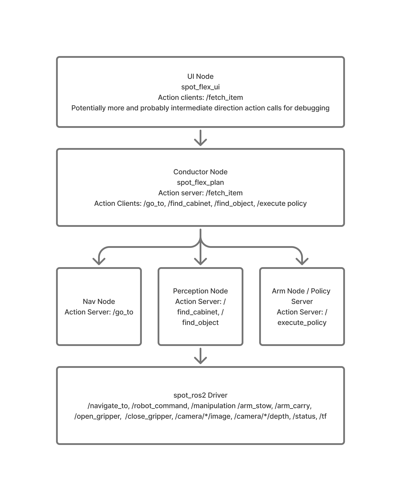

# Project System Architecture

Git repo: https://github.com/trd44/spot-flex-ros

## Overview

Spot Flex is a ROS 2 mobile manipulation system for navigating to task locations, detecting objects and cabinet handles, pushing obstacles, opening a cabinet, retrieving an item, and placing it at a drop-off location.

The primary ROS architecture uses Nav2 for navigation and MoveIt for arm planning. The hardware demo can switch to Spot-native GraphNav and Spot SDK arm/gripper services when those backends are more reliable on the available robot.

## Package Organization

| Package | Type | Description |
|---|---|---|
| `spot_ros2` | External | Boston Dynamics ROS 2 driver and Spot SDK bridge |
| `spot_gazebo_ros2` | External | Gazebo Spot model and simulation assets |
| `spot_flex_msgs` | Custom | Custom actions and services |
| `spot_flex_plan` | Custom | Fetch task conductor and launch files |
| `spot_flex_perception` | Custom | Object, box, and cabinet-handle perception actions |
| `spot_flex_nav` | Custom | Nav2 launch files, depth-to-scan, mapping, named locations, GraphNav helpers |
| `spot_flex_moveit` | Custom | MoveIt arm configuration and mock arm demo |
| `spot_flex_control` | Custom | Navigation adapter, MoveIt service bridge, policy server |
| `spot_flex_sim` | Custom | Gazebo/RViz/noVNC simulation and Nav2 demo launch |
| `spot_flex_mocks` | Custom | Mock servers for development without hardware |
| `spot_flex_ui` | Custom | Prototype command UI |

## System Architecture



```text
FetchItem action
  -> spot_flex_plan conductor FSM
  -> spot_flex_control/nav_node
       -> Nav2 NavigateToPose
       -> Spot GraphNav fallback
  -> spot_flex_perception actions
  -> spot_flex_control/policy_server_node
  -> spot_flex_control/arm_node
       -> MoveIt move_group
       -> Spot SDK arm services fallback
```

## Main Interfaces

### Custom Actions

| Interface | Server | Description |
|---|---|---|
| `/fetch_item` | `spot_flex_plan/conductor_node` | Full fetch flow from the configured start state |
| `/fetch_from_cabinet` | `spot_flex_plan/conductor_node` | Fetch flow starting after the box has already been moved |
| `/fetch_from_open_cabinet` | `spot_flex_plan/conductor_node` | Fetch flow starting after the cabinet has already been opened |
| `/find_box_grasp_point` | `spot_flex_perception/perception_server_node` | Detects a box-edge grasp pixel |
| `/find_cabinet_handle` | `spot_flex_perception/perception_server_node` | Detects a cabinet-handle pixel |
| `/find_object` | `spot_flex_perception/perception_server_node` | Detects a named object pixel |
| `/execute_policy` | `spot_flex_control/policy_server_node` | Runs manipulation policies such as pushing, placing, and cabinet opening |
| `/go_to` | `spot_flex_control/nav_node` | Common navigation action that routes to Nav2, trajectory, or GraphNav |

### MoveIt Arm Services

These services are exposed under `/moveit_spot` when the MoveIt service bridge is enabled:

| Interface | Description |
|---|---|
| `/moveit_spot/arm_unstow` | Move arm to the ready pose |
| `/moveit_spot/arm_stow` | Move arm to the stowed pose |
| `/moveit_spot/arm_carry` | Move arm to the carry pose |
| `/moveit_spot/open_gripper` | Open gripper |
| `/moveit_spot/close_gripper` | Close gripper |
| `/moveit_spot/set_gripper_angle` | Spot-compatible gripper angle service |
| `/moveit_spot/pose_goal` | `PoseStamped` topic for frame-relative MoveIt pose goals |

### Spot-Native Fallback Interfaces

| Interface | Description |
|---|---|
| `/spot/navigate_to` | GraphNav waypoint navigation |
| `/spot/trajectory` | Body trajectory command |
| `/spot/arm_stow`, `/spot/arm_unstow`, `/spot/arm_carry` | Spot SDK arm services |
| `/spot/open_gripper`, `/spot/close_gripper`, `/spot/set_gripper_angle` | Spot SDK gripper services |
| `/spot/arm_pose_commands` | `PoseStamped` topic for Spot SDK hand pose commands |
| `/spot/grasp_pixel` | Spot SDK image-pixel grasp service |
| `/spot/dock` | Docking service |

## Node Descriptions

### Conductor Node (`spot_flex_plan`)

Hosts the high-level fetch actions and executes a YASMIN finite state machine from `spot_flex_plan/demo_fsm.py`.

The FSM calls navigation, perception, policy, and arm/gripper services in sequence. Waypoint data comes from `spot_flex_plan/config/demo_waypoints.yaml`.

### Nav Node (`spot_flex_control`)

Hosts `/go_to` as a common navigation action. The selected backend is controlled by the `backend` parameter:

| Backend | Downstream interface |
|---|---|
| `nav2` | `nav2_msgs/action/NavigateToPose` |
| `trajectory` | `spot_msgs/action/Trajectory` |
| `graphnav` | `spot_msgs/action/NavigateTo` |

### Perception Server (`spot_flex_perception`)

Subscribes to the configured RGB image topic and exposes perception actions for box grasp points, cabinet handles, and named objects. It can optionally call Spot gripper and pixel-grasp services around perception steps.

### Policy Server (`spot_flex_control`)

Hosts `/execute_policy`. It runs manipulation flows for box pushing, cabinet opening, and placing. The node publishes body velocity and arm pose commands and can call Spot or MoveIt-compatible arm services.

### MoveIt Arm Node (`spot_flex_control`)

Provides a small service bridge from task-level arm commands to MoveIt `/move_action`. It supports named arm states, gripper states, gripper angle compatibility, and `PoseStamped` pose goals.

### Simulation (`spot_flex_sim`)

Launches Gazebo, ROS/Gazebo bridges, robot state publishing, RViz, and the Nav2 demo. The default Nav2 simulation uses odom-frame navigation for a stable demonstration; SLAM Toolbox can be enabled explicitly.

## Main Launch Paths

| Launch | Purpose |
|---|---|
| `ros2 launch spot_flex_sim nav2_demo.launch.py` | Gazebo + Nav2 simulation demo |
| `ros2 launch spot_flex_moveit moveit_demo.launch.py` | MoveIt mock arm demo |
| `ros2 launch spot_flex_plan demo.launch.py` | Mock task demo without hardware |
| `ros2 launch spot_flex_plan hardware_demo.launch.py nav_backend:=nav2 launch_nav2:=true launch_moveit:=true` | ROS-native hardware path with Nav2 and MoveIt |
| `ros2 launch spot_flex_plan hardware_demo.launch.py nav_backend:=graphnav arm_service_prefix:=/spot` | Spot-native fallback path |

## External Tools and Libraries

- `spot_ros2` and Boston Dynamics Spot SDK
- Nav2
- MoveIt 2
- Gazebo / Ignition
- OWL-ViT
- Segment Anything
- YOLO / color-based perception utilities
- Docker / VS Code Dev Containers
